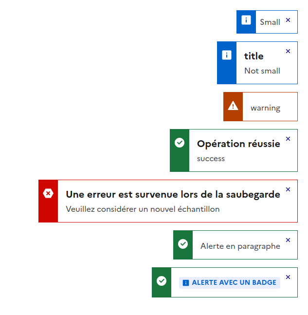
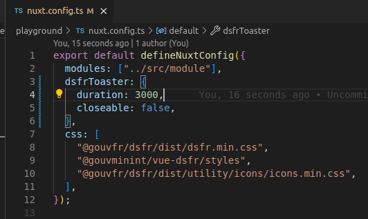

# Module Nuxt Dsfr Toaster

[![npm version][npm-version-src]][npm-version-href]
[![npm downloads][npm-downloads-src]][npm-downloads-href]
[![License][license-src]][license-href]
[![Nuxt][nuxt-src]][nuxt-href]

Module Nuxt Dsfr Toaster pour afficher des alertes.

- [✨ &nbsp;Release Notes](/CHANGELOG.md)
  <!-- - [🏀 Online playground](https://stackblitz.com/github/your-org/@socialgouv/dsfr-toaster-nuxt-module?file=playground%2Fapp.vue) -->
  <!-- - [📖 &nbsp;Documentation](https://example.com) -->

## Features

<!-- Highlight some of the features your module provide here -->

- Duration : Permet de limiter dans le temps l'alerte
- maxToasts : Détruit les toasters au bout d'un délai si trop de toasts à l'écran
- Accessibilité : Ajout du role alert sur les success et error
- Dsfr : Utilisation du DsfrAlert



## Quick Setup

Install the module to your Nuxt application with one command:

```bash
npx nuxi module add @socialgouv/dsfr-toaster-nuxt-module
```



That's it! You can now use Module Nuxt Dsfr Toaster in your Nuxt app ✨

## Utilisation

Créer une balise `<DsfrToaster />` dans un layout puis appeler useToaster n'importe où.

```javascript
const toaster = useToaster();
onMounted(() => {
  toaster.info({
    description: "Va disparaître",
    duration: 2500,
  });
  toaster.info({
    title: "title",
    description: "Small",
    small: true,
  });
  toaster.info({
    title: "title",
    description: "Not small",
    small: false,
  });
  toaster.warning({ description: "warning", closeable: false });
  toaster.success({ title: "Opération réussie", description: "success" });
  toaster.error({
    title: "Une erreur est survenue lors de la saubegarde",
    description: "Veuillez considérer un nouvel échantillon",
  });

  toaster.success({
    // Passe la description via en slot
    slots: {
      default: {
        component: DsfrBadge,
        attrs: { label: "Alerte avec un badge" },
      },
    },
  });
  toaster.success("youyou"); // Passe une description uniquement
});
```

## Contribution

<details>
<summary>Local development</summary>

```bash
# Install dependencies
npm install

# Generate type stubs
npm run dev:prepare

# Develop with the playground
npm run dev

# Build the playground
npm run dev:build

# Run ESLint
npm run lint

# Run Vitest
npm run test
npm run test:watch

# Release new version
npm run release
```

</details>

<!-- Badges -->

[npm-version-src]: https://img.shields.io/npm/v/@socialgouv/dsfr-toaster-nuxt-module/latest.svg?style=flat&colorA=020420&colorB=00DC82
[npm-version-href]: https://npmjs.com/package/@socialgouv/dsfr-toaster-nuxt-module
[npm-downloads-src]: https://img.shields.io/npm/dm/@socialgouv/dsfr-toaster-nuxt-module.svg?style=flat&colorA=020420&colorB=00DC82
[npm-downloads-href]: https://npmjs.com/package/@socialgouv/dsfr-toaster-nuxt-module
[license-src]: https://img.shields.io/npm/l/@socialgouv/dsfr-toaster-nuxt-module.svg?style=flat&colorA=020420&colorB=00DC82
[license-href]: https://npmjs.com/package/@socialgouv/dsfr-toaster-nuxt-module
[nuxt-src]: https://img.shields.io/badge/Nuxt-020420?logo=nuxt.js
[nuxt-href]: https://nuxt.com
